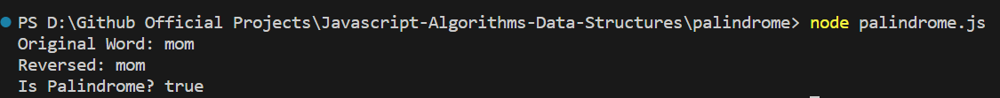

# Palindrome Checker

This simple JavaScript function checks if a given string is a palindrome.

## Usage

To check if a string is a palindrome, call the `isPalindrome` function and pass the string as an argument. The function returns `true` if the string is a palindrome and `false` otherwise.

Example:

const result = isPalindrome("Mom");
console.log("Is Palindrome? " + result);

## Function Details

The isPalindrome function takes a string as an argument and performs the following steps:

    - Converts the input string to lowercase to ensure case-insensitive comparison.
    - Reverses the string.
    - Compares the original string with the reversed string.
    - Returns true if the string is a palindrome (i.e., the reversed string is identical to the original string), otherwise returns false.

Example

For the input string "Mom", the function returns true as "Mom" is a palindrome.

## Notes

    - This function treats spaces and special characters as part of the string. For example, "race car" will not be considered a palindrome because of the space.
    - Modify the input string as needed to fit the use case. For instance, remove spaces or punctuation before passing the string to the function if necessary.